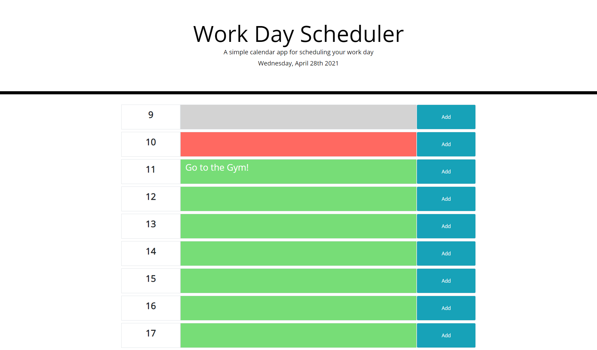

Created a simple day calendar to keep you organized! It is written in military time as I grew up overseas and it makes the most sense to me!

Here is the direct link: https://anneliserowan.github.io/work-day-scheduler/

And here is what it should look like: 

